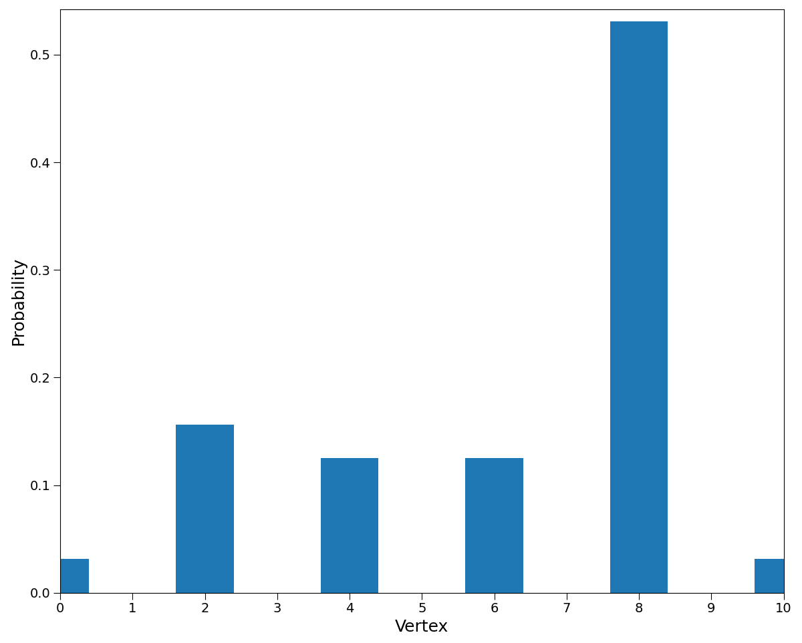

.. _docs_tutorial:

Tutorial
========

Every code based on Hiperwalk follows up to five distinct steps.

#. Import the Hiperwalk package.
#. Define a graph.
#. Construct the quantum walk using the previously defined graph.
#. Run the simulation of the quantum walk.
#. Display the results.

An easy-to-understand example is the coined walk on the line. 
Don't worry about the specifics for the time being; we are 
merely illustrating the steps.

.. testsetup::

   from sys import path as sys_path
   sys_path.append("../..")

Import the Hiperwalk package
----------------------------

>>> import hiperwalk as hpw

Define a graph
--------------

In this step, we generate a line comprising 11 vertices. 
The output is an object from the :class:`hiperwalk.Line` class.

>>> N = 11
>>> line = hpw.Line(N)
>>> line #doctest: +SKIP
<hiperwalk.graph.line.Line object at 0x7ff59f1900d0>

Construct the quantum walk using the previously defined graph
-------------------------------------------------------------

We now create a coined quantum walk on the line with 11 vertices. 
We achieve this by passing the previously created graph as an 
argument to the quantum walk constructor. 
The outcome is an object from the :class:`hiperwalk.Coined` class.

>>> qw = hpw.Coined(line)
>>> qw #doctest: +SKIP
<hiperwalk.quantum_walk.coined_walk.Coined object at 0x7f2691de9840>

Simulate the quantum walk
-------------------------

Before running the simulation, we need to specify the initial state. 
One way to accomplish this is by using the
:meth:`hiperwalk.Coined.ket` method,
which generates a state of the computational basis.

>>> vertex = N // 2
>>> state = qw.ket((vertex, vertex + 1))
>>> state
array([0., 0., 0., 0., 0., 0., 0., 0., 0., 1., 0., 0., 0., 0., 0., 0., 0.,
       0., 0., 0.])

This state corresponds to the walker on
vertex 5 with the coin pointing to vertex 6
(keep in mind that the vertex numbers range from 0 to 10).

To run the simulation, we must specify the initial state and
the number of steps
(i.e., the number of applications of the evolution operator).
When specifying only the final time,
the output will be the final state.
If everything was installed correctly,
the :meth:`hiperwalk.Coined.simulate` method will automatically use
high-performance computing to perform the matrix-vector multiplications.

>>> final_state = qw.simulate(range=(N//2, N//2 + 1),
...                           state=state)

Display the results
-------------------

Presenting the results can be as straightforward as printing them.

>>> final_state
array([[ 0.1767767 ,  0.        ,  0.        , -0.1767767 ,  0.35355339,
         0.        ,  0.        ,  0.        , -0.35355339,  0.        ,
         0.        ,  0.        ,  0.35355339,  0.        ,  0.        ,
         0.70710678,  0.1767767 ,  0.        ,  0.        ,  0.1767767 ]])

         

Or, the output could be more sophisticated. Often, we are interested 
in the probability of the walker being found at each vertex. 
This can be accomplished via the 
:meth:`hiperwalk.Coined.probability_distribution` method
by passing the final state as an argument.

>>> probability = qw.probability_distribution(final_state)
>>> probability
array([[0.03125, 0.     , 0.15625, 0.     , 0.125  , 0.     , 0.125  ,
        0.     , 0.53125, 0.     , 0.03125]])

It's also feasible to plot the probability distribution 
using a simple command.

>>> hpw.plot_probability_distribution(probability) #doctest: +SKIP

This command generates the following plot:

    Probability distribution of a quantum walk on a line.

Next Steps
----------

The remainder of the tutorial is split into the following sections.

.. toctree::
    :maxdepth: 1

    graphs.rst
    graph_constructors.rst
    quantum_walk_models.rst
    plotting.rst
