.. _docs_tutorial_plotting:

========
Plotting
========

After calculating the probability distribution of one or multiple states,
the user may wish to plot the distribution.
This can be done by invoking the standalone
:meth:`hiperwalk.plot_probability_distribution` function.
To plot the probability distribution given the probabilities,
simply pass the probabilities as arguments to the
:meth:`hiperwalk.plot_probability_distribution` function.

>>> import hiperwalk as hpw #doctest: +SKIP
>>> # create graph, quantum walk, simulate
>>> # compute the probability distribution
>>> hpw.plot_probability_distribution(prob_dist) #doctest: +SKIP

This will generate ``len(probs)`` images where
the ``i``-th image corresponds to the ``i``-th probability.
On a Jupyter notebook, the images will be shown in sequence simultaneously.
On a terminal, the first image will be shown and
the program will wait for the user to close the image
-- by pressing the ``q`` key for example --
before showing the next one.

Customization
=============

Albeit plotting is simple,
configuring the plot to behave as the user wishes may be a bit tricky.
We antecipate that the plotting was built on top of
`Matplotlib <https://matplotlib.org/>`_ and
`NetworkX <https://networkx.org/>`_.
Hence, every key argument accepted by these libraries is
accepted by Hiperwalk!
Of course, this depends on the plot type.
It does not make sense to demand ``node_color='red'`` if
a bar plot is being request.

Plot Types
----------

There are five plot types:
bar, histogram, line, plane and graph.
The difference between the plots are explained and illustrated in
the following subsections.
All plots correspond to the following quantum walk simulation on
the :math:`7 \times 7`-dimensional natural grid.

>>> import hiperwalk as hpw
>>> dim = 7
>>> lat = hpw.Grid(dim)
>>> center = (dim//2, dim//2)
>>> right = (center[0] + 1, center[1])
>>> qw = hpw.Coined(lat, shift='persistent', coin='grover')
>>> psi0 = qw.state([[0.5, (center, right)],
...                  [0.5, (right, center)]])
>>> psi = qw.simulate(range=(dim//2, dim//2 + 1), state=psi0)
>>> prob = qw.probability_distribution(psi)
>>> prob
array([[0.       , 0.       , 0.       , 0.015625 , 0.       , 0.       ,
        0.       , 0.       , 0.       , 0.0078125, 0.0078125, 0.0078125,
        0.       , 0.       , 0.       , 0.0078125, 0.0390625, 0.1953125,
        0.0390625, 0.0078125, 0.       , 0.0078125, 0.0390625, 0.0390625,
        0.0078125, 0.0390625, 0.0390625, 0.0078125, 0.0078125, 0.0390625,
        0.0390625, 0.0078125, 0.0390625, 0.0390625, 0.0078125, 0.       ,
        0.0078125, 0.0390625, 0.1953125, 0.0390625, 0.0078125, 0.       ,
        0.       , 0.       , 0.0078125, 0.0078125, 0.0078125, 0.       ,
        0.       ]])

Bar Plot
''''''''

The vertices are represented on the x-axis.
The respective probabilities are represented on the y-axis.
Each vertex is associated with a bar.

>>> hpw.plot_probability_distribution(prob, plot='bar') #doctest: +SKIP

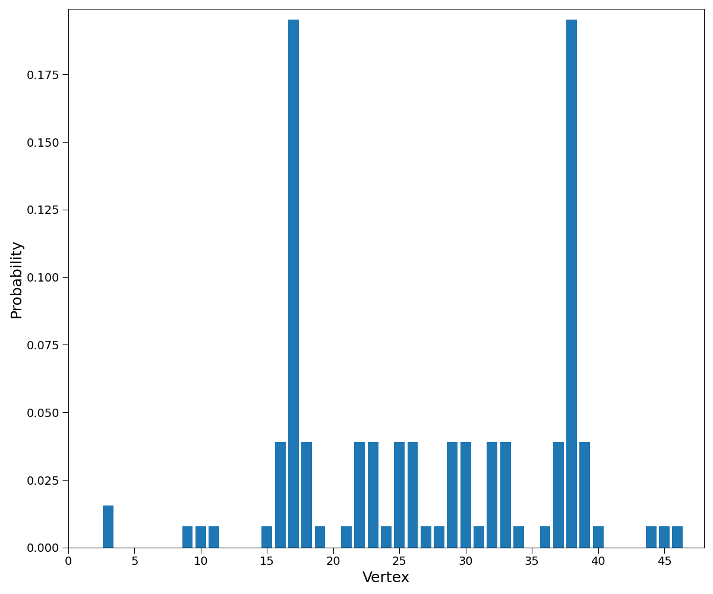

It is built on top of :obj:`matplotlib.pyplot.bar`.
The respective valid matplotlib keywords can be used to customize the plot.

>>> hpw.plot_probability_distribution(
...     prob, plot='bar', color='red', edgecolor='black', linewidth=3,
...     tick_label=[str(lat.vertex_coordinates(i))
...                 for i in range(lat.number_of_vertices())]
... ) #doctest: +SKIP

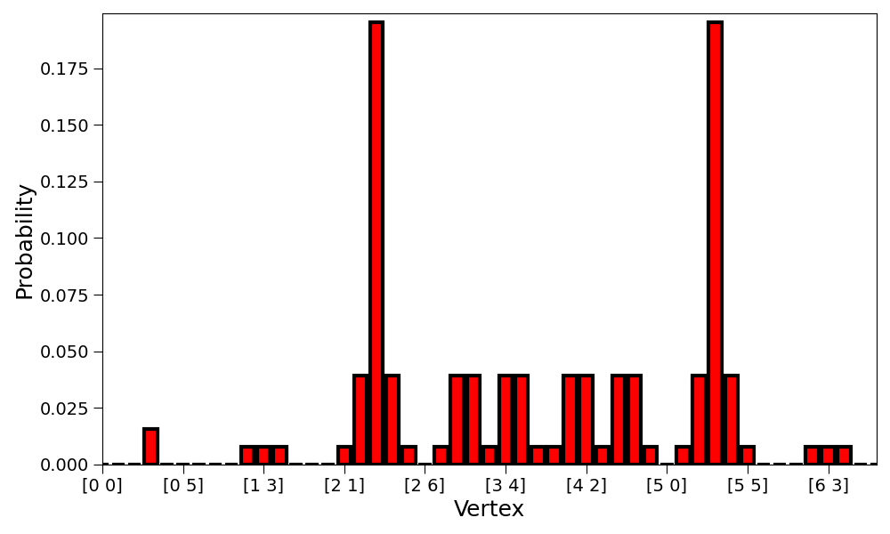

Histogram Plot
''''''''''''''

This is essentially the same as the bar plot
but the ``width`` kwarg is *overriden* so the bars are not separated.

>>> hpw.plot_probability_distribution(prob,
...                                   plot='histogram') #doctest: +SKIP

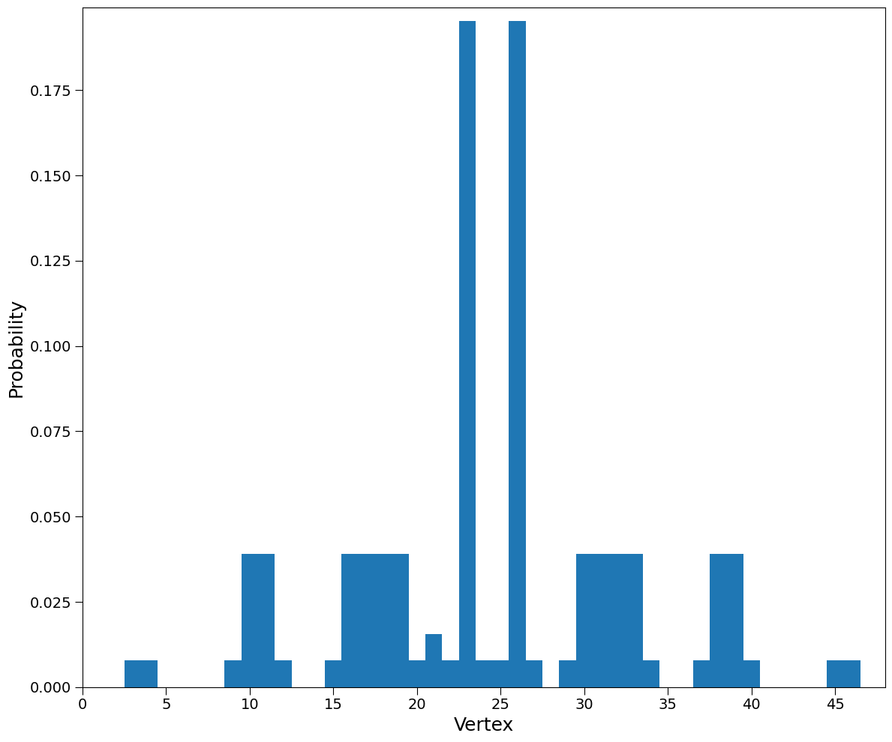

Line Plot
'''''''''

The vertices are represented on the x-axis.
The respective probabilities are represented on the y-axis.
The probability of each vertex is highlighted by a marker.
A line is drawn between adjacent markers.

>>> hpw.plot_probability_distribution(prob, plot='line') #doctest: +SKIP

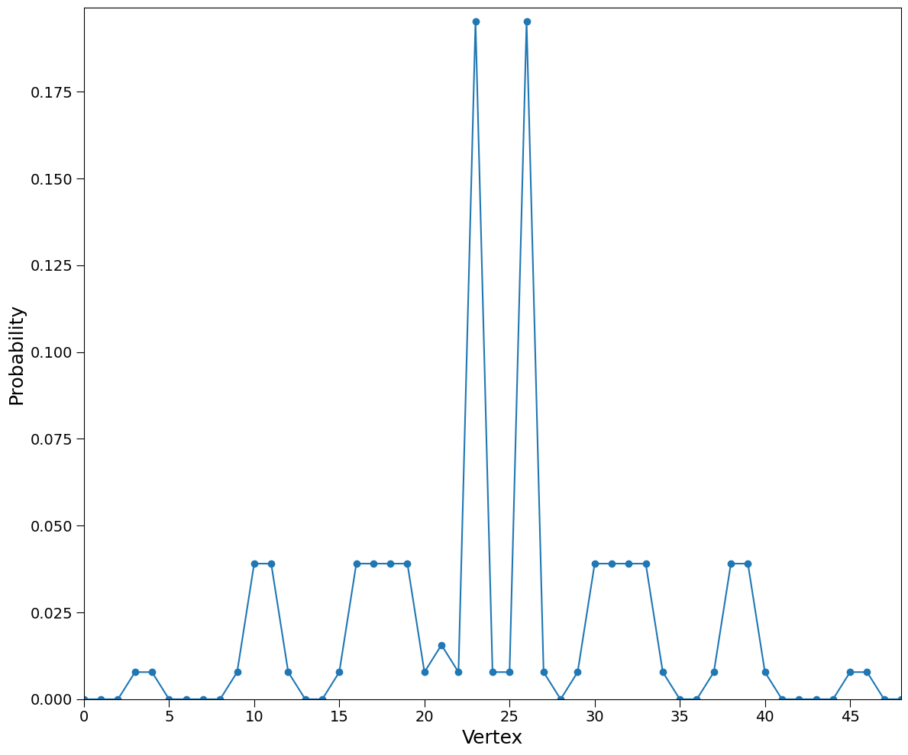

It is built on top of :obj:`matplotlib.pyplot.plot`.
The respective valid matplotlib keywords can be used to customize the plot.

>>> hpw.plot_probability_distribution(
...     prob, plot='line', linewidth=3, color='black', linestyle='--',
...     marker='X', markerfacecolor='yellow', markersize=15,
...     markeredgewidth=2, markeredgecolor='red') #doctest: +SKIP

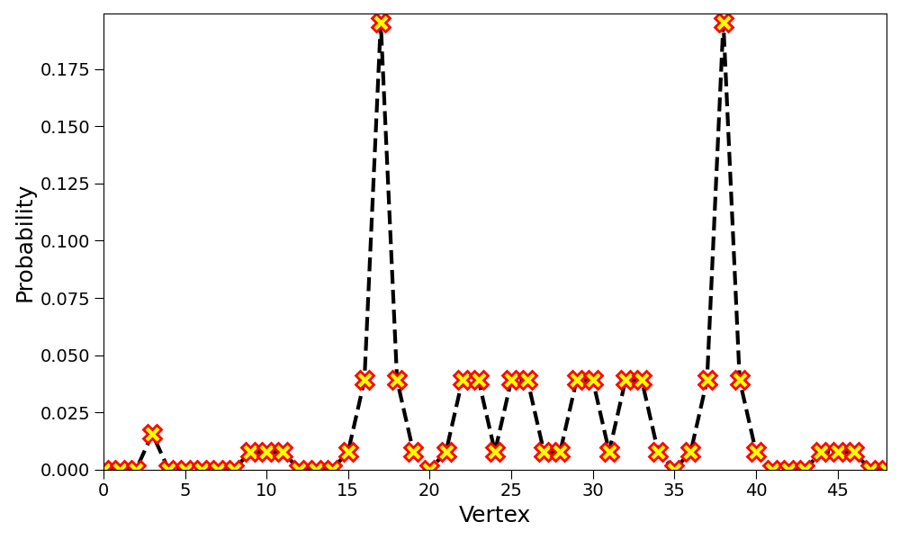

Plane Plot
''''''''''

If a graph is embeddable on the plane,
each vertex can be assigned a cartesian coordinate and
the probability can be shown on the z-axis.
To obtain the correct cartesian coordinates,
the graph *must* be specified.

>>> hpw.plot_probability_distribution(prob, plot='plane',
...                                   graph=lat) #doctest: +SKIP

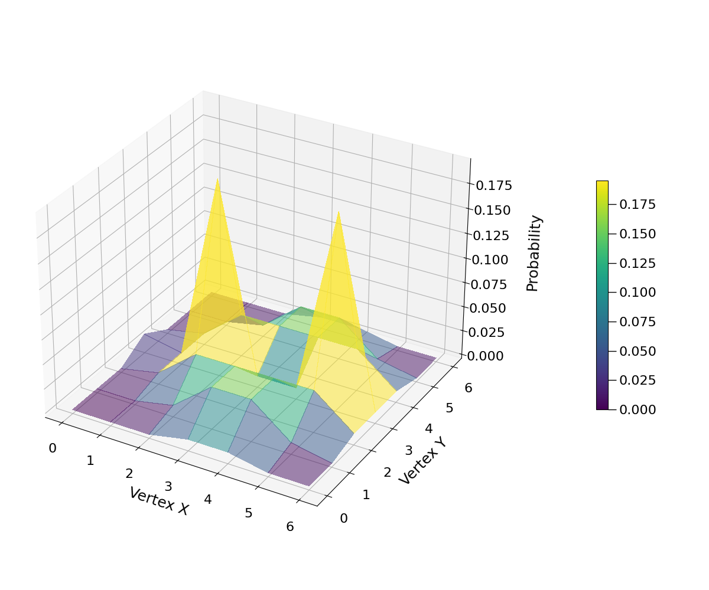

The plotting is built on top of...
:obj:`mpl_toolkits.mplot3d.axes3d.Axes3D.plot_surface`.
Any optional keywords accepted by the matplotlib function can
be passed to the Hiperwalk function.

>>> hpw.plot_probability_distribution(
...     prob, plot='plane', graph=lat, cmap='YlOrRd_r', alpha=1
... ) #doctest: +SKIP

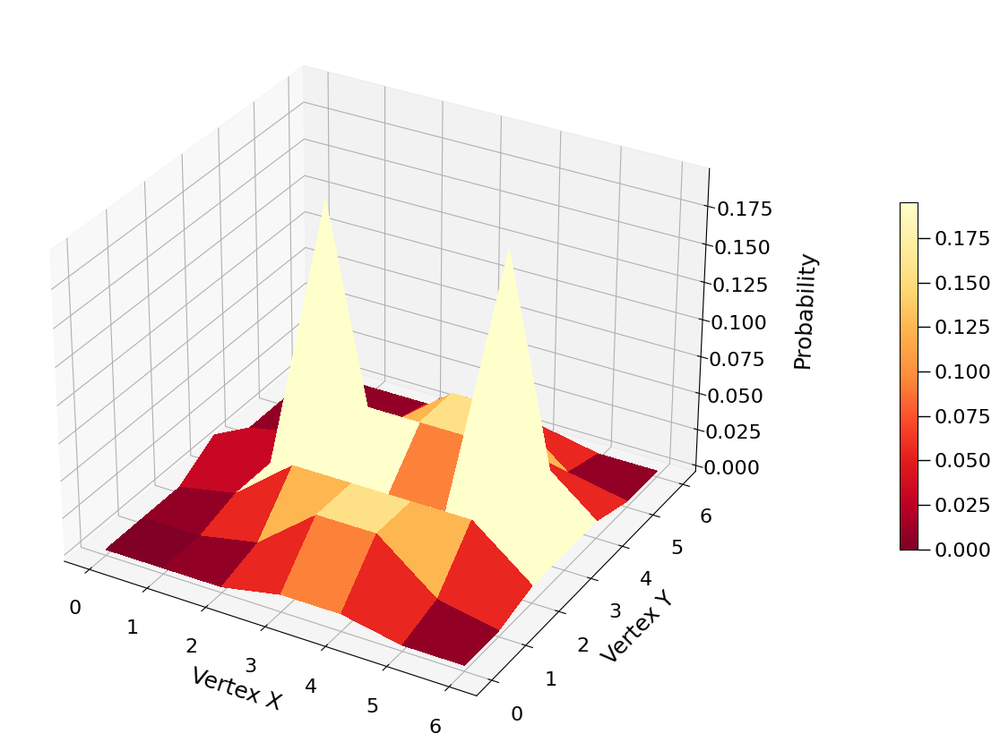

Graph Plot
''''''''''

Draws the graph where probabilities are depicted by
different colors and vertex sizes.
The graph structure is required.

>>> hpw.plot_probability_distribution(
...     prob, plot='graph', graph=lat) #doctest: +SKIP

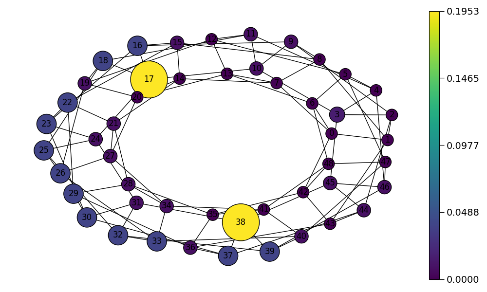

The graph plot is built on top of :obj:`networkx.draw` function and
accepts any valid keywords associated with it.

>>> hpw.plot_probability_distribution(
...     prob, plot='graph', graph=lat,
...     labels={i: lat.vertex_coordinates(i)
...             for i in range(lat.number_of_vertices())},
...     cmap='copper', node_shape='s',
...     font_color='white', font_weight='bold',
...     edge_color='red', width=2, style=':'
... ) #doctest: +SKIP

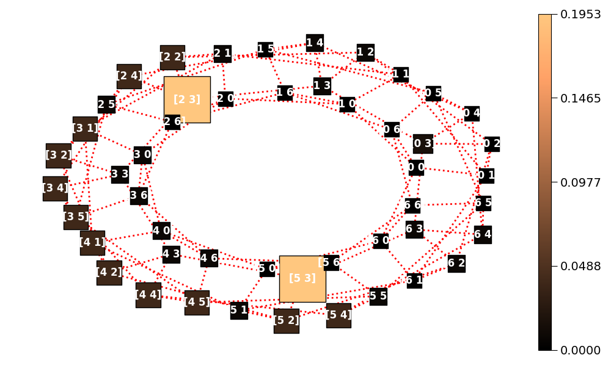

Default Plot Type
'''''''''''''''''

Each Hiperwalk graph is associated with a default graph type.
Hence, it is sufficient to specify the probabilities and the graph
to obtain the default plot.
For instance, the default grid plot is the plane plot.

>>> hpw.plot_probability_distribution(prob, graph=lat) #doctest: +SKIP

Hiperwalk Specific Keyworkds
----------------------------

There are some keywords specific to Hiperwalk.
These keywords are detailed on the
:obj:`hiperwalk.plot_probability_distribution` documentation.
The following is a list of specific Hiperwalk keywords.

* ``plot``
* ``show``
* ``filename``
* ``graph``
* ``rescale``
* ``animate``
* ``interval``
* ``min_node_size``
* ``max_node_size``

In this tutorial, only two keywords are detailed:
``animate`` and ``rescale``.
For better comprehension and visualization,
the probabilities of the intermediate simulation steps are saved.

>>> psi = qw.simulate(range=(dim//2 + 1), state=psi0)
>>> prob = qw.probability_distribution(psi)

``animate``
'''''''''''

If multiple probabilites are stored,
the ``animate`` keyword can be used to generate an animation.
The ``animate`` keyword accepts a boolean value.
If ``animate = False`` an image for each probability is generated.
If ``animate = True`` an animation is generated.

>>> hpw.plot_probability_distribution(
...     prob, graph=lat, animate=True) #doctest: +SKIP

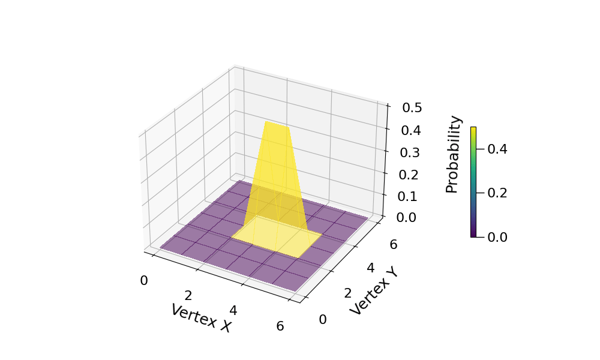

``rescale``
'''''''''''

In the previous section plot, the probability axis was fixed.
As the graph size and number of simulation steps increases,
the walker (and the probabilities) tend to spread.
Consequently, in later simulation steps,
it may be hard to visualize the probabilities.
If ``rescale`` is set to ``True``, each plot is rescaled such that
the maximum probability of the current plot corresponds to
the maximum value on the axis.

>>> hpw.plot_probability_distribution(
...     prob, graph=lat, animate=True, rescale=True) #doctest: +SKIP

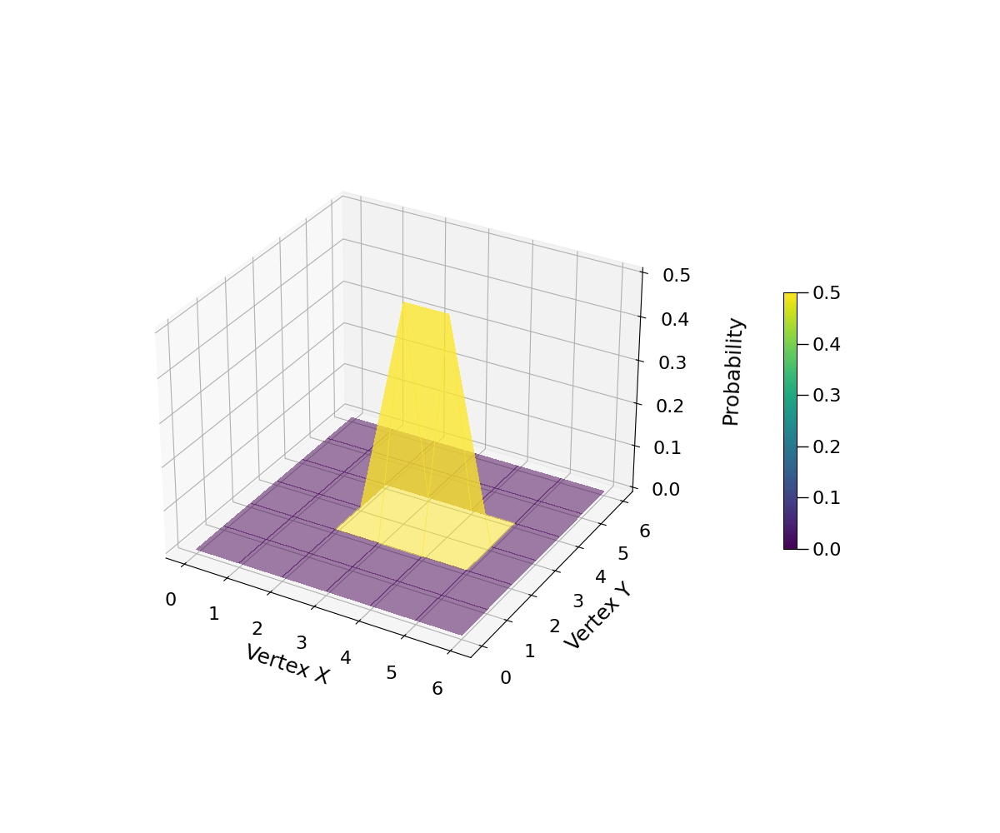
